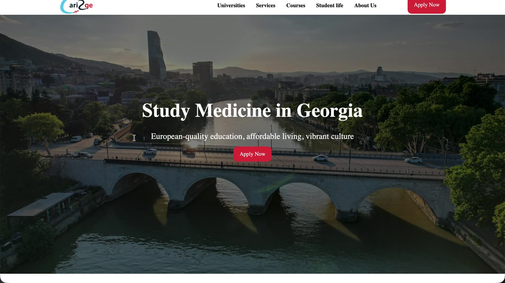
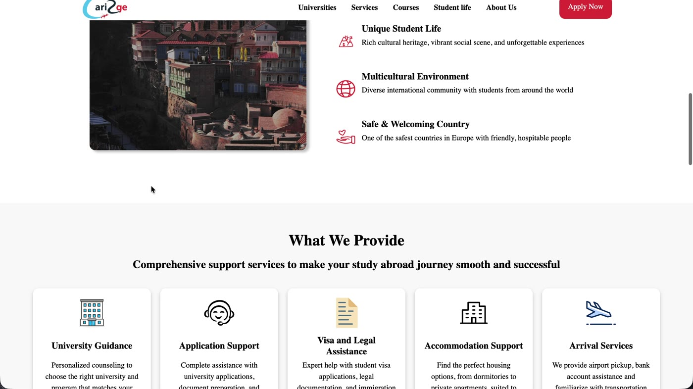
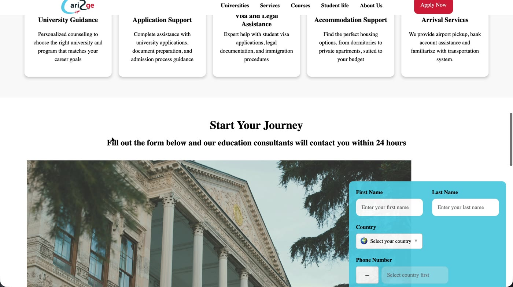
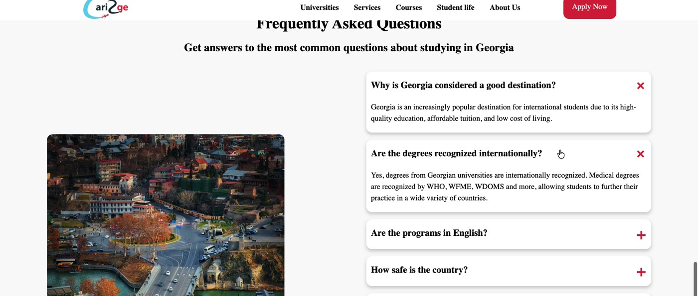

# cari2ge

Live site: https://cari2ge.com

A study-abroad lead generation landing page built for Cari2Ge, a service that helps international students apply to universities in Georgia for medicine and other degree programs. This is a freelance frontend project, designed and built end-to-end from layout to deployment.

## Features

Hero section with a clear value proposition and call-to-action. "Why Choose Georgia" highlights covering student life, multicultural environment, and safety. A services overview including University Guidance, Application Support, Visa and Legal Assistance, Accommodation Support, and Arrival Services. A lead capture form for prospective students. An FAQ accordion answering common questions about studying in Georgia. Responsive design for desktop and mobile.

## Screenshots

### Hero

### Why Choose Georgia

### Services and Application Form

### FAQ

